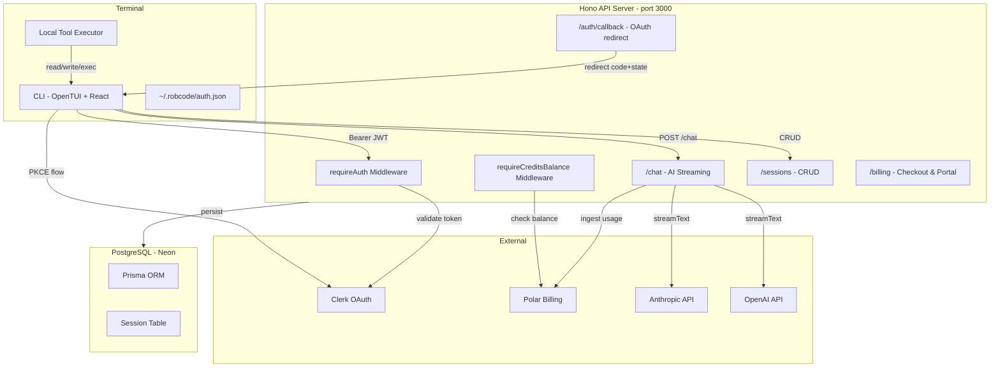
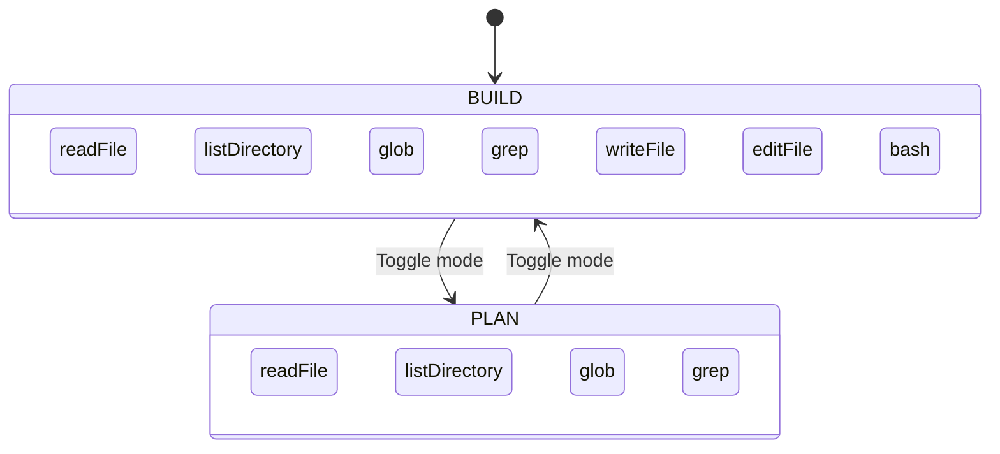
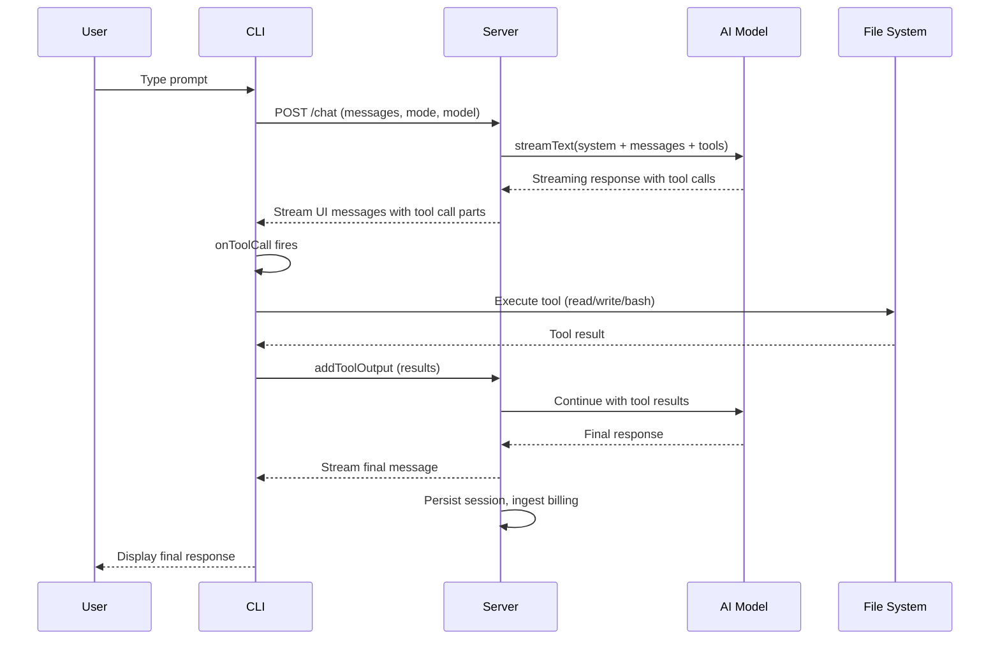
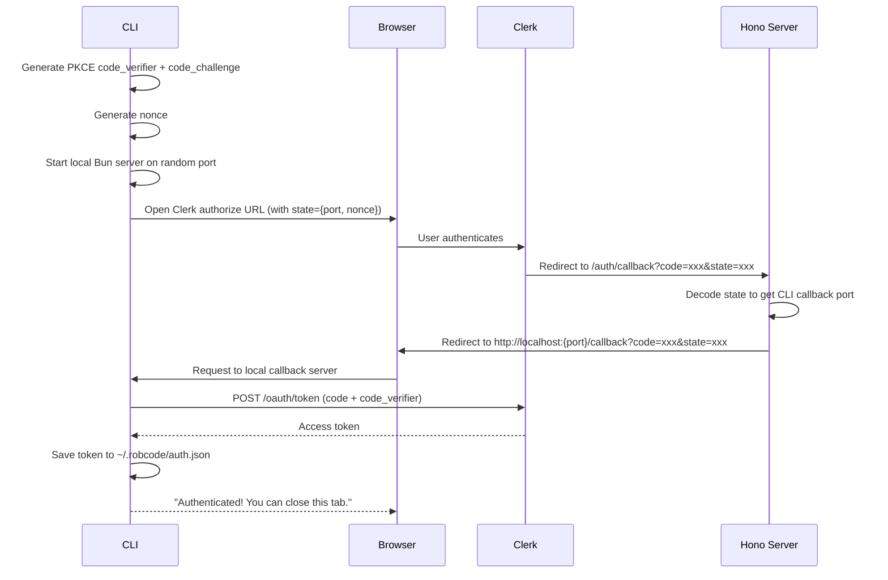

# Building a Production-Grade AI Coding Agent in the Terminal: A Deep Dive into RobCode

> How I architected a multi-model, streaming, billing-ready AI coding assistant that lives in your terminal — powered by Bun, React, OpenTUI, Hono, Clerk, Polar, and the Vercel AI SDK.

---

AI coding agents have exploded in popularity. From GitHub Copilot to Cursor to Claude Code, developers now expect AI assistance deeply integrated into their workflow. But most of these tools are either SaaS products you subscribe to or IDE plugins with limited customization. What if you wanted to build your own — one that you fully control, runs in the terminal, supports multiple AI providers, has real billing, and persists sessions? That's exactly what **RobCode** is.

In this post, I'll walk through the architecture, design decisions, and implementation details of RobCode — a terminal-based AI coding agent I built from the ground up. Whether you're curious about building AI tooling or want to understand how production coding agents work under the hood, this deep dive is for you.

---

## Table of Contents

1. [High-Level Architecture](#high-level-architecture)
2. [The Terminal UI: React in Your Terminal](#the-terminal-ui-react-in-your-terminal)
3. [Plan vs Build: The Dual-Mode System](#plan-vs-build-the-dual-mode-system)
4. [Tool System: How the Agent Interacts with Your Codebase](#tool-system-how-the-agent-interacts-with-your-codebase)
5. [Streaming AI Responses](#streaming-ai-responses)
6. [Authentication: Clerk OAuth with PKCE](#authentication-clerk-oauth-with-pkce)
7. [Billing: Credits-Based Metering with Polar](#billing-credits-based-metering-with-polar)
8. [Multi-Model Support](#multi-model-support)
9. [Session Persistence](#session-persistence)
10. [The Command Palette](#the-command-palette)
11. [Key Technical Decisions and Trade-offs](#key-technical-decisions-and-trade-offs)
12. [Conclusion](#conclusion)

---

## High-Level Architecture

RobCode is a monorepo organized as four packages under Bun workspaces. Here's the 10,000-foot view:



The architecture follows a **client-heavy** pattern: the server handles authentication, AI model orchestration, and billing, while the CLI handles all local tool execution (file reads, writes, shell commands) directly on the user's machine. This design keeps sensitive code on the user's device and reduces server-side complexity.

### Package Breakdown

| Package | Role | Key Technologies |
|---------|------|-----------------|
| [`@robcode/cli`](packages/cli) | Terminal UI, local tool execution, auth | OpenTUI, React, AI SDK |
| [`@robcode/server`](packages/server) | API, AI streaming, billing ingestion | Hono, AI SDK, Clerk SDK, Polar SDK |
| [`@robcode/database`](packages/database) | Schema, Prisma client | Prisma, PostgreSQL |
| [`@robcode/shared`](packages/shared) | Shared types, schemas, tool contracts | Zod, AI SDK |

---

## The Terminal UI: React in Your Terminal

One of the most striking aspects of RobCode is that its entire UI is built with **React** — but rendered in the terminal, not a browser. This is possible thanks to [OpenTUI](https://github.com/ethangj/opentui), a library that provides a React reconciler for terminal rendering.

```tsx
// packages/cli/src/index.tsx
import { createCliRenderer } from "@opentui/core";
import { createRoot } from "@opentui/react";
import { createMemoryRouter, RouterProvider } from "react-router";

const router = createMemoryRouter([
  {
    path: "/",
    element: <RootLayout />,
    children: [
      { index: true, element: <Home /> },
      { path: "sessions/new", element: <NewSession /> },
      { path: "sessions/:id", element: <Session /> },
    ]
  }
]);

const renderer = await createCliRenderer({ targetFps: 60, exitOnCtrlC: false });
createRoot(renderer).render(<RouterProvider router={router} />);
```

This means you get all the benefits of React's component model — providers, hooks, context, routing — in a terminal application. The component tree looks remarkably like a web app:

```tsx
// packages/cli/src/layouts/root-layout.tsx
export function RootLayout() {
  return (
    <ThemeProvider>
      <ToastProvider>
        <KeyboardLayerProvider>
          <DialogProvider>
            <PromptConfigProvider>
              <ThemedRoot>
                <Outlet />
              </ThemedRoot>
            </PromptConfigProvider>
          </DialogProvider>
        </KeyboardLayerProvider>
      </ToastProvider>
    </ThemeProvider>
  );
}
```

### Provider Stack Explained

- **ThemeProvider** — Manages color themes with a context-based API
- **ToastProvider** — Shows transient notifications (login success, errors)
- **KeyboardLayerProvider** — Handles layered keyboard shortcuts (base layer vs dialog layer)
- **DialogProvider** — Manages modal dialogs for agent selection, model picking, session browsing
- **PromptConfigProvider** — Tracks current mode (PLAN/BUILD) and selected model

### The Input Bar: More Than Just Text

The [`input-bar.tsx`](packages/cli/src/components/input-bar.tsx:1) component is a sophisticated piece of terminal UI engineering. It supports:

1. **`@mention` file autocompletion** — Type `@` followed by a path fragment, and it scans the current project directory to suggest files and folders
2. **`/command` palette** — Type `/` to access commands like `/new`, `/agents`, `/models`, `/login`, `/upgrade`
3. **Multi-line input** — The textarea grows as you type longer prompts

The mention system walks the filesystem in real-time, filtering entries that match your query while respecting `.gitignore`-like exclusions (`node_modules`):

```tsx
// Simplified mention candidate resolution
async function getMentionCandidates(query: string): Promise<MentionCandidate[]> {
  const normalizedQuery = query.startsWith("./") ? query.slice(2) : query;
  // ... walks directory, filters hidden files and node_modules
  // Returns sorted { path, kind: "file" | "directory" } entries
}
```

---

## Plan vs Build: The Dual-Mode System

RobCode operates in two distinct modes, each with a different set of available tools. This design prevents the AI from accidentally modifying files when you just want analysis.



The mode is defined in the shared package and enforced on both client and server:

```typescript
// packages/shared/src/schemas.ts
export const Mode = {
  BUILD: "BUILD",
  PLAN: "PLAN",
} as const;

export const readOnlyToolContracts = {
  readFile: tool({ /* ... */ }),
  listDirectory: tool({ /* ... */ }),
  glob: tool({ /* ... */ }),
  grep: tool({ /* ... */ }),
};

export const buildToolContracts = {
  ...readOnlyToolContracts,
  writeFile: tool({ /* ... */ }),
  editFile: tool({ /* ... */ }),
  bash: tool({ /* ... */ }),
};
```

On the client side, [`local-tools.ts`](packages/cli/src/lib/local-tools.ts:29) enforces mode restrictions:

```typescript
export async function executeLocalTool(toolName: string, input: unknown, mode: ModeType) {
  if (mode === Mode.PLAN && !["readFile", "listDirectory", "glob", "grep"].includes(toolName)) {
    throw new Error(`Tool ${toolName} is not available in PLAN mode`);
  }
  // ... execute tool
}
```

The system prompt also adapts per mode. In PLAN mode, the AI is instructed to analyze and propose — never modify. In BUILD mode, it's told to implement changes directly and verify its work.

---

## Tool System: How the Agent Interacts with Your Codebase

The tool system is the heart of any AI coding agent. RobCode implements seven tools, each with strict Zod schemas and safety constraints:

| Tool | Mode | Description | Safety Constraint |
|------|------|-------------|-------------------|
| [`readFile`](packages/cli/src/lib/local-tools.ts:35) | Both | Reads a file | Max 10K chars per read |
| [`listDirectory`](packages/cli/src/lib/local-tools.ts:43) | Both | Lists directory entries | Skips hidden files, `node_modules` |
| [`glob`](packages/cli/src/lib/local-tools.ts:60) | Both | Pattern-based file search | Max 200 results, skips `node_modules` |
| [`grep`](packages/cli/src/lib/local-tools.ts:79) | Both | Regex content search | Max 50 matches |
| [`writeFile`](packages/cli/src/lib/local-tools.ts:123) | BUILD | Create/overwrite files | Restricted to project directory |
| [`editFile`](packages/cli/src/lib/local-tools.ts:134) | BUILD | Targeted string replacement | `oldString` must be unique in file |
| [`bash`](packages/cli/src/lib/local-tools.ts:146) | BUILD | Run shell commands | Timeout at 30s, output capped at 20K chars |

### Critical Safety Design: Path Sandboxing

Every tool that interacts with the filesystem goes through [`resolveInsideCwd`](packages/cli/src/lib/local-tools.ts:11):

```typescript
function resolveInsideCwd(path: string) {
  const cwd = process.cwd();
  const resolved = resolve(cwd, path);
  const rel = relative(cwd, resolved);

  if (rel.startsWith("..") || isAbsolute(rel)) {
    throw new Error("Path is outside the project directory");
  }

  return { cwd, resolved };
}
```

This ensures the AI can never escape the project directory — no reading `/etc/passwd`, no writing to `~/.ssh`. The [`editFile`](packages/cli/src/lib/local-tools.ts:138) tool goes further by requiring the `oldString` to be unique in the file, preventing ambiguous edits:

```typescript
const occurrences = content.split(oldString).length - 1;
if (occurrences === 0) throw new Error("oldString not found in file");
if (occurrences > 1) throw new Error(`oldString is ambiguous; found ${occurrences} matches`);
```

### Tool Execution Flow



The key insight: **tools execute on the client**, not the server. When the AI model decides to call a tool, the server streams that intent to the CLI, the CLI executes it locally, and sends the result back. This means:

1. File contents never leave your machine except to be sent to the AI provider
2. Shell commands run in your actual terminal environment
3. The server remains stateless regarding file access

---

## Streaming AI Responses

RobCode uses the Vercel AI SDK's [`streamText`](packages/server/src/routes/chat.ts:123) for real-time streaming:

```typescript
const result = streamText({
  model: resolvedModel.model,
  system: buildSystemPrompt({ mode }),
  messages: modelMessages,
  tools,
  providerOptions: resolvedModel.providerOptions,
  onFinish(event) {
    completedUsage = event.totalUsage;
  },
});

return result.toUIMessageStreamResponse({
  originalMessages: nextMessages,
  messageMetadata({ part }) {
    if (part.type === "start") return { mode, model };
    if (part.type !== "finish") return undefined;
    return {
      mode, model,
      durationMs: Date.now() - startTime,
      ...(completedUsage ? { usage: completedUsage } : {}),
    };
  },
  async onFinish(event) {
    // Persist full conversation to database
    // Ingest billing usage
  },
});
```

### Message Merging Strategy

One subtle but important detail is how RobCode handles message updates. When the client sends messages, the server merges them with previously persisted messages:

```typescript
// packages/server/src/routes/chat.ts:94-112
const previousMessages = Array.isArray(session.messages)
  ? (session.messages as unknown as robcodeUIMessage[])
  : [];
const mergedMessages = [...previousMessages];

for (const message of messages) {
  const existingMessageIndex = mergedMessages.findIndex((m) => m.id === message.id);
  if (existingMessageIndex === -1) {
    mergedMessages.push(message);
  } else {
    mergedMessages[existingMessageIndex] = message; // Update in place
  }
}
```

This deduplication ensures that tool call results and streaming updates replace their previous partial states without creating duplicate messages.

### Tool Call Auto-Continuation

When the AI returns a message with pending tool calls, RobCode automatically sends the tool results back. This is handled by the AI SDK's [`sendAutomaticallyWhen`](packages/cli/src/hooks/use-chat.ts:88) hook:

```typescript
const chat = useAiChat({
  transport,
  onToolCall({ toolCall }) {
    void executeLocalTool(toolCall.toolName, toolCall.input, mode)
      .then((output) => chat.addToolOutput({ tool: toolCall.toolName, toolCallId: toolCall.toolCallId, output }))
      .catch((error) => chat.addToolOutput({ tool: toolCall.toolName, toolCallId: toolCall.toolCallId, state: "output-error", errorText: error.message }));
  },
  sendAutomaticallyWhen: lastAssistantMessageIsCompleteWithToolCalls,
});
```

The server also checks for pending tool calls before finalizing a session update. If the last message still has unresolved tool calls (state is not `output-available` or `output-error`), it skips persistence and billing — the message is still in flight.

---

## Authentication: Clerk OAuth with PKCE

Authenticating a CLI application is notoriously tricky. You can't use traditional web OAuth redirects because there's no browser context. RobCode solves this with a clever **Authorization Code with PKCE** flow:



The `state` parameter is the key innovation. It's a base64url-encoded JSON payload containing:

```typescript
// packages/cli/src/lib/oauth.ts
type OAuthState = {
  nonce: string;  // Prevents CSRF
  port: number;   // Where the CLI's callback server is listening
};
```

The Hono server at [`/auth/callback`](packages/server/src/routes/auth.ts:3) simply decodes the state, extracts the port, and redirects the browser to the CLI's local callback server:

```typescript
const [encoded] = state.split(".");
const payload = JSON.parse(Buffer.from(encoded, "base64url").toString());
const port = payload.port;
const redirectUrl = `http://localhost:${port}/callback?code=${encodeURIComponent(code)}&state=${encodeURIComponent(state)}`;
return c.redirect(redirectUrl);
```

The token is persisted to `~/.robcode/auth.json` with restrictive permissions (`0o600` for the file, `0o700` for the directory) so other users on the same machine can't read it.

On every API request, the CLI's [`api-client.ts`](packages/cli/src/lib/api-client.ts:5) reads the token and attaches it as a Bearer header. If a 401 is received, it automatically clears the stored token.

On the server side, the [`requireAuth`](packages/server/src/middleware/require-auth.ts:10) middleware uses Clerk's `authenticateRequest` to validate OAuth tokens:

```typescript
export const requireAuth = createMiddleware(async (c, next) => {
  const auth = await authenticateOAuthRequest(c.req.raw);
  if (!auth) return c.json({ error: "Unauthorized" }, 401);
  c.set("userId", auth.userId);
  await next();
});
```

---

## Billing: Credits-Based Metering with Polar

RobCode implements a production-ready billing system using [Polar](https://polar.sh). The model is **credit-based metering**:

### The Credits Model

1 credit = $0.01 USD. This peg makes credits intuitive (like cents) while remaining granular enough for small AI usage:

```typescript
// packages/server/src/lib/credits.ts
const USD_PER_CREDIT = 0.01;

function convertUsdToCredits(estimatedCostUsd: number) {
  if (estimatedCostUsd <= 0) return 0;
  return Math.max(1, Math.ceil(estimatedCostUsd / USD_PER_CREDIT));
}
```

Each model has its own pricing in the shared registry:

```typescript
// packages/shared/src/models.ts
export const SUPPORTED_CHAT_MODELS = [
  { id: "claude-opus-4-6", provider: "anthropic",
    pricing: { inputUsdPerMillionTokens: 5, outputUsdPerMillionTokens: 25 } },
  { id: "gpt-5.4", provider: "openai",
    pricing: { inputUsdPerMillionTokens: 2.5, outputUsdPerMillionTokens: 15 } },
  // ... more models
];
```

After each AI response completes, the usage is calculated and ingested:

```typescript
// packages/server/src/routes/chat.ts (onFinish handler)
const billableUsage = calculateCreditsForUsage({
  provider: resolvedModel.provider,
  model: resolvedModel.modelId,
  usage: completedUsage,
});

await ingestAiUsage({
  externalCustomerId: userId,
  eventId: `chat-message:${event.responseMessage.id}`,
  credits: billableUsage.credits,
});
```

### Credit Gating

Before creating a session or sending a chat message, the [`requireCreditsBalance`](packages/server/src/middleware/require-credits-balance.ts:5) middleware checks if the user has any credits left:

```typescript
const creditsBalance = await getAvailableCreditsBalance(userId);
if (creditsBalance <= 0) {
  return c.json({ error: "No credits remaining. Run /upgrade to buy more credits." }, 402);
}
```

This is a simple launch-time gate — it checks that credits exist before starting work but doesn't reserve the full eventual cost. For low-volume apps, this is pragmatic and sufficient.

### Checkout and Customer Portal

The billing routes provide two endpoints:

- [`POST /billing/checkout`](packages/server/src/routes/billing.ts:6) — Creates a Polar checkout session for purchasing credits
- [`POST /billing/portal`](packages/server/src/routes/billing.ts:13) — Opens the Polar customer portal for managing subscriptions

Both are triggered from the CLI's command menu via `/upgrade` and `/billing` commands.

---

## Multi-Model Support

RobCode supports six models across two providers with provider-specific configurations:

| Model | Provider | Input $/1M tokens | Output $/1M tokens | Special Config |
|-------|----------|-------------------|--------------------|----------------|
| Claude Opus 4.6 | Anthropic | $5.00 | $25.00 | Extended thinking (10K budget tokens) |
| Claude Sonnet 4.6 | Anthropic | $3.00 | $15.00 | Extended thinking (10K budget tokens) |
| Claude Haiku 4.5 | Anthropic | $1.00 | $5.00 | — |
| GPT-5.4 | OpenAI | $2.50 | $15.00 | Reasoning summary (detailed) |
| GPT-5.4 Mini | OpenAI | $0.75 | $4.50 | — |
| GPT-5.4 Nano | OpenAI | $0.20 | $1.25 | — |

The model resolution system in [`models.ts`](packages/server/src/lib/models.ts:91) maps model IDs to provider-specific SDK instances with optional configurations:

```typescript
const ANTHROPIC_PROVIDER_OPTIONS = {
  "claude-opus-4-6": {
    anthropic: { thinking: { type: "enabled", budgetTokens: 10000 } }
  },
};

const OPENAI_PROVIDER_OPTIONS = {
  "gpt-5.4": {
    openai: { thinking: { reasoningSummary: "detailed" } }
  },
};
```

The UI lets users switch models dynamically via the `/models` command, which opens a dialog listing all available models. The default is Claude Opus 4.6.

---

## Session Persistence

All conversations are persisted to PostgreSQL via Prisma. The schema is intentionally simple:

```prisma
// packages/database/prisma/schema.prisma
model Session {
  id        String   @id @default(cuid())
  userId    String
  title     String
  createdAt DateTime @default(now())
  updatedAt DateTime @updatedAt
  messages  Json     @default("[]")

  @@index([userId])
}
```

The entire conversation history is stored as a JSON column — an array of AI SDK `UIMessage` objects. This design trades some relational queryability for flexibility; since messages are always loaded and saved as a complete array, there's no need for a separate `Message` table.

Sessions are scoped to users via a `userId` index, and all queries include a `userId` filter to prevent cross-user access.

---

## The Command Palette

The command menu is activated by typing `/` in the input bar. It provides quick access to common operations:

| Command | Description |
|---------|-------------|
| `/new` | Start a new conversation |
| `/agents` | Switch between PLAN and BUILD mode |
| `/models` | Select AI model |
| `/sessions` | Browse and resume past sessions |
| `/theme` | Change color theme |
| `/login` | Sign in via browser OAuth |
| `/logout` | Clear stored credentials |
| `/upgrade` | Purchase more credits |
| `/billing` | Open billing portal |

The command system is built on a typed interface:

```typescript
type Command = {
  name: string;
  description: string;
  value: string;
  action: (ctx: CommandContext) => void | Promise<void>;
};
```

Filtering is done client-side with fuzzy matching, and the UI renders a scrollable list with keyboard navigation (arrow keys + enter) and mouse support.

---

## Key Technical Decisions and Trade-offs

### 1. Client-Side Tool Execution

**Decision**: Tools execute on the CLI, not the server.

**Trade-off**: This keeps file contents local and reduces server complexity, but means the CLI must be running for tool execution to work. It also means tool execution speed depends on the user's machine, which is usually a benefit, not a drawback.

### 2. JSON Message Storage

**Decision**: Store entire conversation as a JSON array in a single column.

**Trade-off**: Simpler schema, no joins needed. But you lose the ability to query individual messages, and the JSON column can grow large for long conversations. For a terminal-based tool with typically focused sessions, this is a reasonable trade-off.

### 3. Launch-Time Credit Gating

**Decision**: Check credit balance before starting work, don't reserve estimated costs.

**Trade-off**: Simple implementation but allows edge-case overspend. For a low-volume, single-developer tool, this is pragmatic. A high-volume SaaS would need a reservation system.

### 4. Bun as Runtime

**Decision**: Use Bun throughout — for the CLI binary, the server runtime, and the package manager.

**Trade-off**: Bun provides excellent performance, native TypeScript support, and built-in tools (Glob, spawn, serve). The trade-off is a smaller ecosystem compared to Node.js, but for this use case, everything needed was available.

### 5. React in the Terminal

**Decision**: Use OpenTUI to render React components in the terminal.

**Trade-off**: The developer experience is fantastic — you write React like you would for a web app. But terminal rendering has constraints (fixed character grid, limited color support) that require different thinking about layout and interaction patterns.

---

## Conclusion

RobCode demonstrates that building a production-grade AI coding agent is achievable with modern tools and thoughtful architecture. The combination of Bun, React (via OpenTUI), Hono, the Vercel AI SDK, Clerk, and Polar creates a stack that's both powerful and developer-friendly.

Key takeaways from building RobCode:

1. **The AI SDK does the heavy lifting** — Streaming, tool calling, message validation are all handled by `streamText`, `validateUIMessages`, and `convertToModelMessages`. You focus on your tools and business logic.

2. **Client-side tools are simpler and more secure** — Running tools on the CLI avoids building a sandboxed server-side execution environment and keeps user code on their machine.

3. **Dual-mode is essential** — Separating PLAN (read-only) from BUILD (read-write) prevents accidents and gives users confidence when they just want analysis.

4. **PKCE + local callback server is a clean CLI auth pattern** — The state-parameter-as-port-carrier trick elegantly solves the CLI OAuth redirect problem without requiring a separate desktop app.

5. **Credits-based metering with Polar is surprisingly straightforward** — Once the meter is configured, billing becomes a matter of calculating usage and calling `polar.events.ingest()`.

The full source code is available on GitHub. If you're thinking about building your own AI coding tool — or just want to understand how they work — I hope this deep dive has been valuable.

---

*RobCode is open source. Check it out at [github.com/Rezowanur-Rahman-Robin/RobCode](https://github.com/Rezowanur-Rahman-Robin/RobCode).*