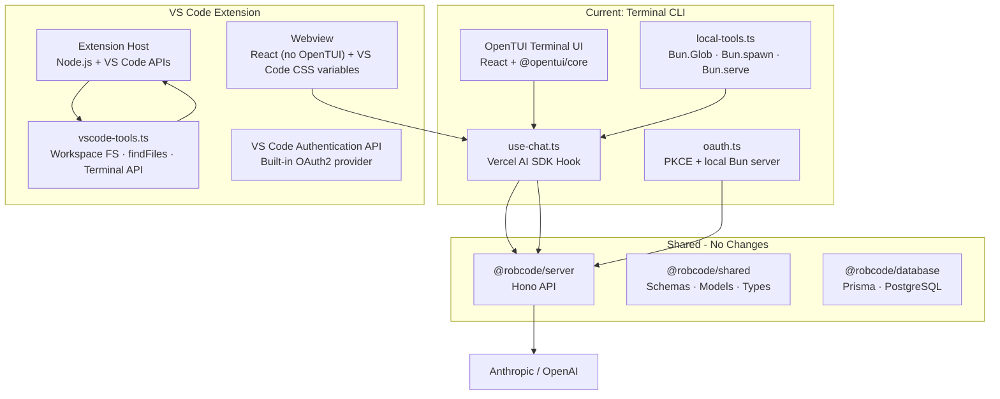

# RobCode as a VS Code Extension — Feasibility & Architecture Plan

## Verdict: Yes, Absolutely Possible

RobCode's architecture is surprisingly well-prepared for this. The server, shared types, chat hook, and tool system are already framework-agnostic. The only layer that needs a full rewrite is the UI — which is also the smallest layer.

---

## Current Architecture vs. VS Code Extension Architecture



## What Stays (Zero Changes)

| Package | Reason |
|---------|--------|
| [`@robcode/shared`](packages/shared/src/index.ts) | Pure TypeScript types, schemas, tool contracts, model definitions. No runtime dependencies on Bun or terminal. |
| [`@robcode/server`](packages/server/src/index.ts) | Hono API server. Already an HTTP service. No changes needed. |
| [`@robcode/database`](packages/database/prisma/schema.prisma) | Prisma schema and client. Completely independent. |

## What Gets Adapted (Minor Bun → Node.js Migration)

### [`use-chat.ts`](packages/cli/src/hooks/use-chat.ts) → Reused directly

The chat hook uses `@ai-sdk/react` with `DefaultChatTransport`. It's pure React — zero Bun dependencies. It imports from `shared` for types and `local-tools` for execution. In the extension, it would import from `vscode-tools` instead.

### [`local-tools.ts`](packages/cli/src/lib/local-tools.ts) → Rewritten for VS Code APIs

| Current Tool | Bun API Used | VS Code Replacement |
|---|---|---|
| `readFile` | `fs/promises.readFile` | `vscode.workspace.fs.readFile()` + `TextDecoder` |
| `listDirectory` | `fs/promises.readdir` + `stat` | `vscode.workspace.fs.readDirectory()` |
| `glob` | `Bun.Glob` | `vscode.workspace.findFiles()` — uses VS Code's built-in glob engine |
| `grep` | `Bun.spawn(["grep", ...])` | `vscode.workspace.findTextInFiles()` or spawn grep as child process |
| `writeFile` | `fs/promises.writeFile` | `vscode.workspace.fs.writeFile()` |
| `editFile` | `fs/promises.readFile` + `writeFile` | Same, using workspace FS APIs |
| `bash` | `Bun.spawn(["bash", ...])` | `vscode.window.createTerminal()` for interactive OR `child_process.exec()` for headless execution with output capture |

**Path sandboxing**: The `resolveInsideCwd` function maps directly to `vscode.workspace.workspaceFolders`. VS Code enforces workspace boundaries natively.

### [`oauth.ts`](packages/cli/src/lib/oauth.ts) → VS Code Authentication API

The current PKCE flow starts a local HTTP server to catch the OAuth callback. VS Code extensions have a built-in [`vscode.authentication`](https://code.visualstudio.com/api/references/vscode-api#authentication) API:

```typescript
// Instead of manual PKCE + Bun.serve:
const session = await vscode.authentication.getSession(
  'robcode',  // provider ID (registered in package.json)
  ['openid', 'email', 'profile'],
  { createIfNone: true }
);
const token = session.accessToken;
```

This eliminates ~160 lines of OAuth code and handles token refresh automatically.

---

## What Gets Rebuilt (UI Layer)

The terminal UI (`@opentui/core` + `@opentui/react`) is the only layer that cannot migrate. VS Code extensions use **webviews** — sandboxed iframes with full HTML/CSS/JS. The replacement strategy:

### Architecture

```
┌─────────────────────────────────────────┐
│  Extension Host (Node.js)               │
│  ┌───────────────────────────────────┐  │
│  │  vscode-tools.ts                  │  │
│  │  use-chat.ts (adapted)            │  │
│  │  auth provider registration       │  │
│  │  postMessage bridge               │  │
│  └──────────┬────────────────────────┘  │
│             │ postMessage                │
│  ┌──────────▼────────────────────────┐  │
│  │  Webview (React SPA)              │  │
│  │  ┌─────────────────────────────┐  │  │
│  │  │ ChatPanel                    │  │  │
│  │  │  ├─ MessageList              │  │  │
│  │  │  │   ├─ UserMessage          │  │  │
│  │  │  │   └─ BotMessage           │  │  │
│  │  │  │       └─ MarkdownText     │  │  │
│  │  │  ├─ InputBar                 │  │  │
│  │  │  └─ StatusBar                │  │  │
│  │  └─────────────────────────────┘  │  │
│  └───────────────────────────────────┘  │
└─────────────────────────────────────────┘
```

### Component Migration Map

| Current Component | VS Code Equivalent | Effort |
|---|---|---|
| [`bot-message.tsx`](packages/cli/src/components/messages/bot-message.tsx) | React component with CSS modules. Reasoning/tool parts get the same left-border treatment. | Low — logic is identical, just swap `<box>` for `<div>`, `<text>` for `<span>` |
| [`markdown-text.tsx`](packages/cli/src/components/messages/markdown-text.tsx) | The parser logic (`parseInline`, `parseMarkdownBlocks`) is pure TypeScript — copy as-is. Replace `<box>`/`<text>` with HTML elements + CSS classes. | Low — parser is fully reusable |
| [`input-bar.tsx`](packages/cli/src/components/input-bar.tsx) | `<textarea>` with @mention autocomplete dropdown. VS Code has built-in mention providers via `InlineCompletionItemProvider`. | Medium |
| [`command-menu/`](packages/cli/src/components/command-menu/) | Map commands to VS Code's [`contributes.commands`](https://code.visualstudio.com/api/references/contribution-points#contributes.commands). The command palette is native to VS Code. | Low — 9 commands map cleanly |
| Dialogs (themes, models, sessions) | QuickPick API (`vscode.window.createQuickPick()`) for selection lists. | Low |
| [`session-shell.tsx`](packages/cli/src/components/session-shell.tsx) | Webview panel with toolbar. VS Code provides native view containers. | Medium |
| Theme system | VS Code CSS variables (`--vscode-editor-background`, etc.). The user's VS Code theme applies automatically. | Low — no custom theme system needed |

### UI Framework Choice

Two viable approaches:

**Option A: React in Webview (Recommended)**
- Reuse the existing React components with minimal rewrites
- Use [Vite](https://vitejs.dev) to bundle the webview SPA
- Style with VS Code CSS variables for native look-and-feel
- Communication via `acquireVsCodeApi().postMessage()`

**Option B: Vanilla HTML/CSS with Preact**
- Smaller bundle size (~3KB vs ~40KB)
- Simpler setup, but more manual DOM manipulation
- Less code reuse from existing components

**Recommendation: Option A** — The existing components are already in React, and the `@ai-sdk/react` hook is React-only. The bundle size difference is negligible for a webview panel.

---

## New Package Structure

```
packages/vscode/
├── package.json              # Extension manifest (activationEvents, contributes, etc.)
├── tsconfig.json
├── .vscodeignore
├── extension/
│   └── src/
│       ├── extension.ts      # activate/deactivate entry point
│       ├── auth.ts           # VS Code authentication provider
│       ├── tools.ts          # Tool execution using VS Code APIs
│       ├── chat-panel.ts     # Webview panel creation + message bridge
│       └── commands.ts       # Registered VS Code commands
├── webview/
│   ├── index.html
│   └── src/
│       ├── main.tsx           # React entry point (Vite)
│       ├── App.tsx
│       ├── hooks/
│       │   └── use-chat.ts    # Adapted from cli (same logic, different tool import)
│       ├── components/
│       │   ├── BotMessage.tsx
│       │   ├── UserMessage.tsx
│       │   ├── MarkdownText.tsx  # Parser logic reused, rendering adapted
│       │   ├── InputBar.tsx
│       │   └── StatusBar.tsx
│       └── styles/
│           └── main.css       # VS Code CSS variables + component styles
└── resources/
    └── icon.png
```

---

## Implementation Plan

### Phase 1: Scaffolding & Authentication (Foundation)
1. Initialize `packages/vscode` with [`package.json`](https://code.visualstudio.com/api/references/extension-manifest) extension manifest
2. Register `robcode` authentication provider using `vscode.authentication.registerAuthenticationProvider` — replaces all of [`oauth.ts`](packages/cli/src/lib/oauth.ts)
3. Register commands: `robcode.newSession`, `robcode.openSession`, `robcode.togglePlanMode`, `robcode.switchModel`, `robcode.switchTheme`, `robcode.login`, `robcode.logout`, `robcode.upgrade`, `robcode.billing`

### Phase 2: Tool Execution (Core Migration)
4. Create [`tools.ts`](packages/cli/src/lib/local-tools.ts) using VS Code workspace APIs — same 7 tools, same schemas from `shared`, different underlying APIs
5. Implement grep via `workspace.findTextInFiles` or `child_process.exec("grep")`
6. Implement bash via `child_process.exec` with timeout (replace `Bun.spawn`)

### Phase 3: Webview Chat UI (UI Migration)
7. Set up Vite + React for the webview bundle
8. Port [`markdown-text.tsx`](packages/cli/src/components/messages/markdown-text.tsx) parser as-is; replace OpenTUI rendering with HTML/CSS
9. Port [`bot-message.tsx`](packages/cli/src/components/messages/bot-message.tsx) — same structure, HTML elements
10. Port [`input-bar.tsx`](packages/cli/src/components/input-bar.tsx) — @mention system can reference VS Code workspace files
11. Port remaining components (user-message, error-message, spinner, status-bar)

### Phase 4: Chat Integration
12. Adapt [`use-chat.ts`](packages/cli/src/hooks/use-chat.ts) to run in webview context — use `acquireVsCodeApi().postMessage()` for tool execution requests
13. Create `chat-panel.ts` as the postMessage bridge between webview and extension host
14. Wire up streaming responses — the Vercel AI SDK streaming works identically

### Phase 5: Session Management & Persistence
15. Session list view using VS Code's TreeView API in the sidebar
16. Session persistence via the existing `@robcode/server` API — no changes needed
17. QuickPick for model switching, theme selection (use VS Code's built-in theme)

### Phase 6: Polish & Publish
18. Add activity bar icon and view container
19. Configure `.vscodeignore` for minimal bundle size
20. Set up CI/CD for `vsce package` and `vsce publish`
21. Marketplace listing with README, screenshots, changelog

---

## Key Advantages Over Terminal CLI

| Feature | Terminal CLI | VS Code Extension |
|---|---|---|
| **File diffs** | Text-only display | VS Code diff editor (native, side-by-side) |
| **File operations** | Writes via tool calls | Writes + auto-open in editor |
| **Terminal output** | Plain text in message | VS Code terminal panel (colors, clickable links) |
| **Authentication** | Manual PKCE + local server | `vscode.authentication` API (seamless) |
| **Theme** | 22 custom themes + OpenTUI colors | User's VS Code theme (works automatically) |
| **Keyboard shortcuts** | OpenTUI key handling | VS Code keybindings (customizable) |
| **Command palette** | Custom `/` menu | VS Code native command palette (Ctrl+Shift+P) |
| **@mentions** | Custom dropdown | VS Code mention providers + quick suggestions |
| **Distribution** | `bun install` / `npm install -g` | VS Code Marketplace (one-click install) |

---

## One Critical Consideration

The current [`local-tools.ts`](packages/cli/src/lib/local-tools.ts) executes tools **directly on the user's machine** with filesystem access. In a VS Code extension, tool execution happens in the **extension host process**, which is a Node.js environment with full access to VS Code APIs. This is actually **better** than the terminal approach because:

- VS Code's workspace APIs are sandboxed to the open workspace
- File operations can be previewed in the editor before committing
- Terminal commands run in the integrated terminal (visible to the user)
- The extension can use VS Code's diagnostic APIs to highlight errors

The only Bun-specific code that needs replacement is:
- `Bun.Glob` → `vscode.workspace.findFiles()`
- `Bun.spawn` → `child_process.exec()` / `child_process.spawn()`
- `Bun.serve` → Eliminated entirely (replaced by VS Code auth API)

No other Bun dependencies exist in the tool execution layer.